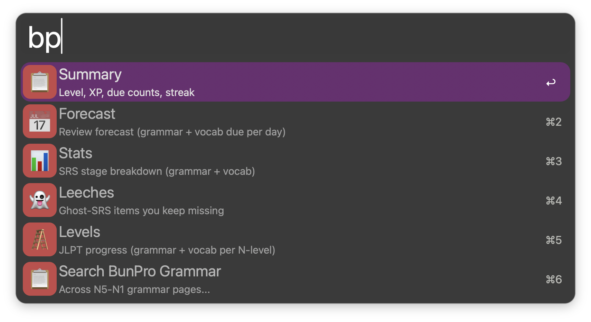
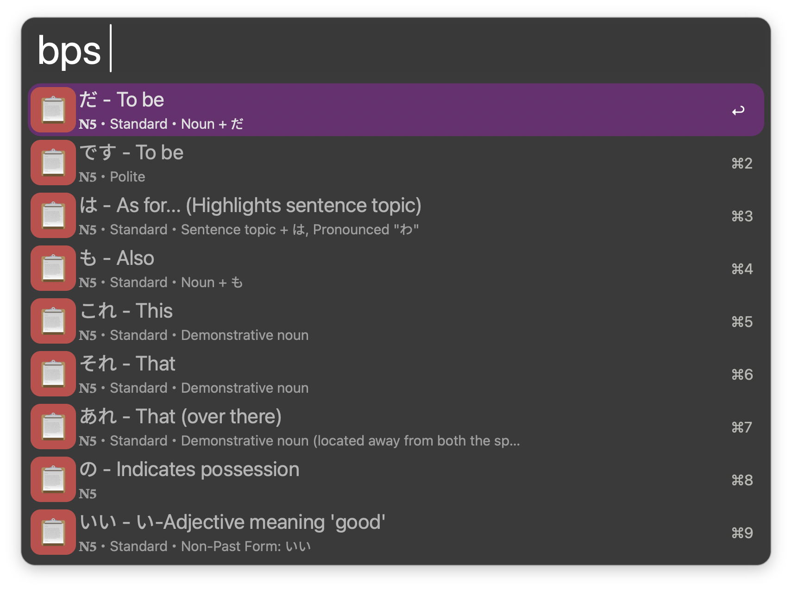
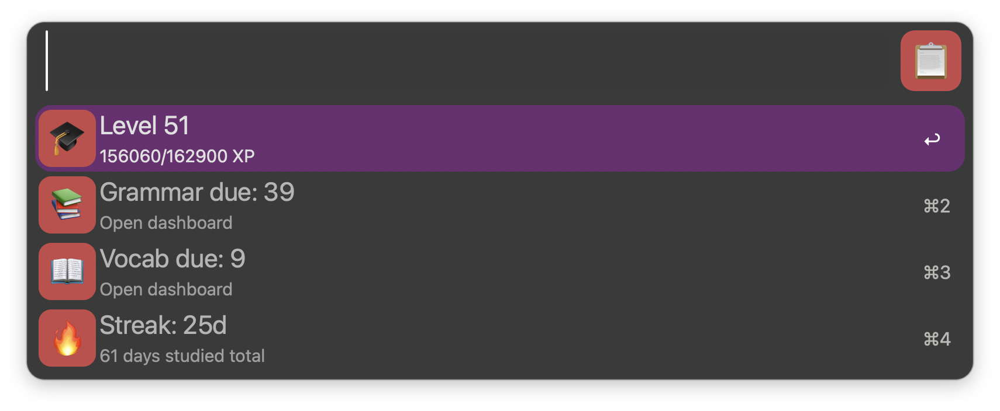

# BunPro for Alfred

Search BunPro grammar points and review your personal progress from Alfred.

## Usage

| Keyword | Function |
| --- | --- |
| `bps` | Search BunPro grammar points by kana, romaji, or English. |
| `bp` | Browse your dashboard summary, statistics, levels, forecast, and leeches. |





Open the Summary view to see your current BunPro progress.



## Install

1. Download the latest `BunPro.alfredworkflow` from [Releases](https://github.com/aleksgorbenko/alfred-workflow-bunpro/releases).
2. Double-click it and let Alfred import it.
3. Requires [Alfred](https://www.alfredapp.com) with a Powerpack licence.

## Development

- Python 3.14, standard library only.
- `data/grammar.json` contains the searchable grammar reference.
- Runtime code is in `src/bunpro/`.

```sh
make check   # lint, format check, and tests
make build   # package dist/BunPro.alfredworkflow
make release VERSION=v1.0.0
make sync-plist WORKFLOW_DIR=/path/to/installed/workflow
```

## My Other Workflows

- [Nihongo for Alfred](https://github.com/aleksgorbenko/alfred-workflow-nihongo)
- [WaniKani for Alfred](https://github.com/aleksgorbenko/alfred-workflow-wanikani)
- [Netlify for Alfred](https://github.com/aleksgorbenko/alfred-workflow-netlify)
- [2Do for Alfred](https://github.com/aleksgorbenko/alfred-workflow-2do)
- [Discogs for Alfred](https://github.com/aleksgorbenko/alfred-workflow-discogs)
- [Bandcamp for Alfred](https://github.com/aleksgorbenko/alfred-workflow-bandcamp)
- [config](https://github.com/aleksgorbenko/config)
